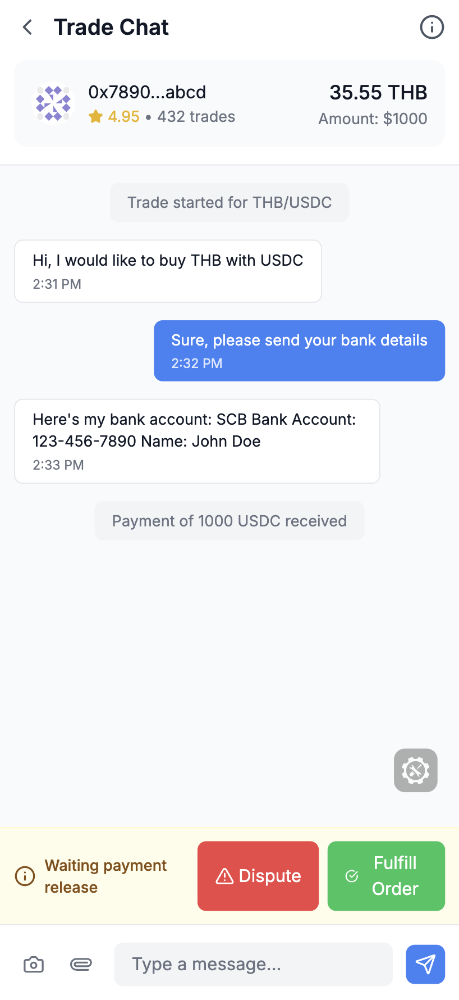

## Setup

```bash
cp .env.example .env
pnpm i
pnpm dev

```

To run as a mini app choose a production app in the dev portal and use NGROK to tunnel. Set the `NEXTAUTH_URL` and the redirect url if using sign in with worldcoin to that ngrok url

Open [http://localhost:3000](http://localhost:3000) with your browser to see the result.

View docs: [Docs](https://minikit-docs.vercel.app/mini-apps)

[Developer Portal](https://developer.worldcoin.org/)

Screenshots:





